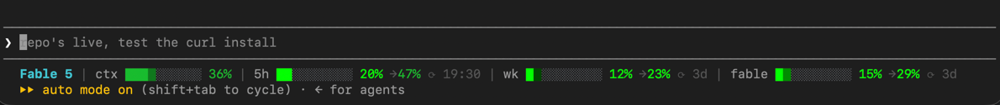

# claude-burnup

**Your context burn but not like, ugly.** _Inspired by - ~~name redacted until permission given~~._

A single-file burn-up status line for [Claude Code](https://code.claude.com) —
model, context consumption, and every rate-limit window your account reports,
each with a **projection of where it lands at reset** if your current pace
continues.



## Install

```bash
curl -fsSL https://raw.githubusercontent.com/relativityboy/claude-burnup/main/claude-burnup.sh \
  -o ~/.claude/claude-burnup.sh && chmod +x ~/.claude/claude-burnup.sh
```

No network. No credentials. It renders only the JSON Claude Code already passes
to status line commands on stdin.

## What it shows
```
Fable 5 | ctx ███░░░░░░░ 30% | 5h ██░░░░░░░░ 18% →40% ⟳ 17:33 | wk █░░░░░░░░░ 7% →13% ⟳ 3d
```
| Segment | Meaning |
|---|---|
| `Fable 5` | current model |
| `ctx` | context window consumed (works with 200k and 1M windows — percentages come from Claude Code itself) |
| `5h` | 5-hour session window consumed · `→N%` projected at reset · `⟳ HH:MM` reset time |
| `wk` | weekly (all models) consumed · projection · `⟳ 3d` time until reset |
| model-scoped weeklies | e.g. the Fable/Opus weekly — appears automatically once your Claude Code version populates `rate_limits.model_scoped` on statusline stdin (the field is in the client's schema; not yet populated as of 2.1.198) |

Segments show a dim `–` when their data is absent (normal for the first moments
of a session, before the first API response).

## Color bands


Every percentage — bars, numbers, and projections — is banded independently:

- **lime** `#00ff00` — under 33%
- **green** `rgb(25,188,46)` — under 60%
- **amber** `rgb(230,185,0)` — under 85%
- **red** `rgb(220,50,47)` — 85% and up
- **bold bright red** — projections **over 100%**, which are valid output: they
  mean "at this pace you exhaust the window before it resets."

## The gradient cell

Bars are ten full-block cells. Completed cells render at full band color. The
*in-progress* cell is a full block whose **brightness encodes progress within
its 10%**: the band color scaled by `(10 + 9r)%` for `r` = 1–9, i.e. 19% → 91%
brightness, snapping to 100% when the block completes. Empty cells are a fixed
neutral gray, so their visibility never depends on the band color next to them.
You can read a bar to roughly the percent without reading the number.

Add to `~/.claude/settings.json`:

```json
{
  "statusLine": {
    "type": "command",
    "command": "~/.claude/claude-burnup.sh",
    "refreshInterval": 30
  }
}
```

`refreshInterval` keeps the projections and reset countdowns ticking between
turns; Claude Code also re-runs the command after every message.

## Requirements

- `jq`
- a truecolor (24-bit ANSI) terminal — iTerm2, Ghostty, kitty, WezTerm, recent
  Terminal.app, most Linux terminals
- Claude Code recent enough to pass `context_window` and `rate_limits` on
  statusline stdin (2026 builds; older clients degrade to `–` segments)
- bash 3.2+ (stock macOS works), BSD or GNU `date`

## Customize

- **Colors:** the four `R;G;B` triplets at the top of the script.
- **Bands:** the thresholds in `band_rgb()`.
- **Debug:** run with `BURNUP_DEBUG=1` in the environment to dump the raw stdin
  JSON to `~/.claude/statusline-last.json` and see exactly what your account
  reports.

## Uninstall

Delete the `statusLine` block from `~/.claude/settings.json` and remove
`~/.claude/claude-burnup.sh`.

## Provenance

Built by [Donovan Walker](https://github.com/relativityboy) in collaboration
with Claude. MIT licensed — see [LICENSE](LICENSE).
